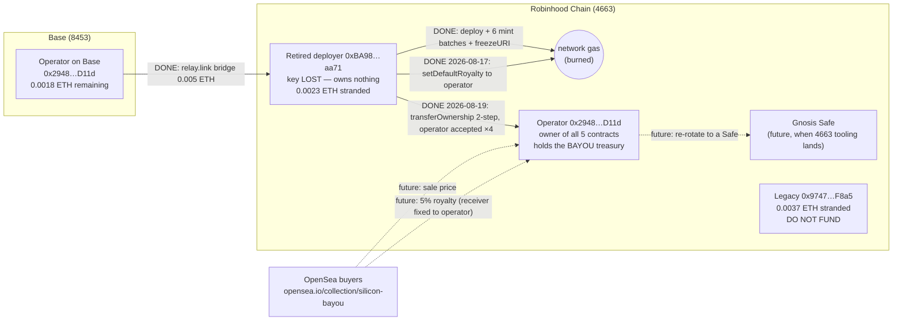

# Deployment record — Silicon Bayou (BAYOU) on Robinhood Chain

**Status: LIVE and verified on-chain.** Every fact below was re-checked directly
against the public RPC (`https://rpc.mainnet.chain.robinhood.com`) on
**2026-08-17**, not just read from local records.

| | |
|---|---|
| Contract | [`0xA81aEd6f3a5Faea95197786ba162e706Fd938d20`](https://robinhoodchain.blockscout.com/address/0xA81aEd6f3a5Faea95197786ba162e706Fd938d20) |
| Chain | Robinhood Chain mainnet, chain ID **4663** (gas in native ETH) |
| Name / symbol | `Silicon Bayou` / `BAYOU` |
| Supply | **198 / 198 minted** (`nextTokenId` = 199; `MAX_SUPPLY` is a compiled constant — sold out forever) |
| Holder | All 198 tokens at operator wallet `0x29486Fc6B2E7184Dd4aF4d310D4f85F4262fD11d` (verified `ownerOf(1)`, `ownerOf(198)`, `balanceOf` = 198) |
| Metadata | `uriFrozen() = true` — permanently locked to `https://raw.githubusercontent.com/Dozier-Tech-Group/silicon-bayou/master/metadata/swamp/{id}.json` |
| Deploy tx | [`0x766d…717e`](https://robinhoodchain.blockscout.com/tx/0x766d5bcdf0788dff618625aec9ffac0e944652a7246564459732857423a6717e) — status 1, block 39,071,035 |
| First mint tx | `0xaa6b…dfb9a` — status 1, block 39,071,059 (minting ran as batches; `MAX_BATCH` = 33, deployer nonce ended at 8: deploy + 6 batches + freeze) |
| Owner | Operator `0x29486Fc6B2E7184Dd4aF4d310D4f85F4262fD11d` — **2-step rotation completed 2026-08-19** (`pendingOwner` = 0x0; re-rotate to a Safe when chain 4663 tooling supports it) |
| Royalty (ERC-2981) | 5% (500 bps) to operator `0x2948…D11d` — **fixed 2026-08-17**, tx [`0x30de…b3c0`](https://robinhoodchain.blockscout.com/tx/0x30de93de064a376dbe0a9e494d3d6a96dd846e95e7fec886882e1960f1c6b3c0) |
| Paused | false |
| OpenSea | **[opensea.io/collection/silicon-bayou](https://opensea.io/collection/silicon-bayou)** (listed 2026-08-17) |

The art the frozen metadata points at is `art/swamp-222/1.png … 198.png` on
`master` — the cleaned rebuild (numbers removed, flat backgrounds). Because the
metadata host is GitHub raw on `master`, **the images shown on OpenSea are
whatever this repo's `master` serves** — treat those 198 PNGs as frozen.
Tokens **199–222** in `art/swamp-222/` are special-edition art only; they can
never be minted on this contract (`MAX_SUPPLY = 198` is `constant`). Minting
them would require a decision to launch a second contract.

## Credits rail (deployed & verified on-chain 2026-08-18)

| | |
|---|---|
| MergedCredit (MC) | [`0x040f12C71ddA0bA9D91E94016ea5C348106ab429`](https://robinhoodchain.blockscout.com/address/0x040f12C71ddA0bA9D91E94016ea5C348106ab429) — 0 decimals, supply 50, all escrowed by the board |
| BountyBoard | [`0xd7899073819206828b7f4c7bB8aE4C530E93C0A2`](https://robinhoodchain.blockscout.com/address/0xd7899073819206828b7f4c7bB8aE4C530E93C0A2) — wired to live BAYOU; settle/withdraw require holding a gator |
| AccessDesk | [`0x7EEc6e95179B8ae86CEbA24025ae35BaDbf0d4e9`](https://robinhoodchain.blockscout.com/address/0x7EEc6e95179B8ae86CEbA24025ae35BaDbf0d4e9) — treasury = operator `0x2948…D11d`, take 3000 bps |
| Funded bounties | 1001 (25 MC), 1002 (15 MC), 1003 (10 MC) — open, unsettled; see `agents/tasks.json` |
| Owners | All three on operator `0x2948…D11d` — **rotated with BAYOU, accepts completed 2026-08-19** |

The off-chain half is Gator Works (`agents/README.md`): holders link wallets by
signature, agents work funded tasks in CI, the oracle settles merged PRs.

## Wallet roster (balances verified 2026-08-17)

| Wallet | Role | Robinhood 4663 | Base 8453 |
|---|---|---|---|
| `0xBA98546Ea9E60Ff469bE7735c0a482C86865aa71` | Retired throwaway deployer — **key LOST** (confirmed 2026-08-19). Owns nothing; its leftover gas is written off. | 0.0023 ETH (stranded) | 0 |
| `0x29486Fc6B2E7184Dd4aF4d310D4f85F4262fD11d` | Operator; holds all 198 BAYOU; gas source that funded the launch | 0.0042 ETH | 0.0018 ETH |
| `0x97471f8Aa113aF7043B599Ccfb1702F2F78CF8a5` | Legacy wallet — key not exportable. **Do not fund**; it may leak outbound. | 0.0037 ETH (stranded) | 0.0005 ETH (stranded) |
| `0xA81a…8d20` (contract) | Holds no ETH by design (no public sale, no payable functions) | 0 | — |

## Where the ETH goes

There is **no mint revenue** — all 198 were owner-minted for gas only. The only
ETH movements in this system are (a) gas and (b) future OpenSea sale proceeds +
5% royalties. (The once-planned deployer sweep is off: the key is lost and its
0.0023 ETH is written off.)

Solid arrows happened; dashed arrows are future flows.

## Open action items (in order)

1. ~~Redirect royalties~~ **DONE 2026-08-17** — `setDefaultRoyalty(operator, 500)`,
   tx `0x30de…b3c0`, verified via `royaltyInfo`.
2. ~~Rotate ownership off the deploy EOA~~ **DONE 2026-08-19** — 2-step
   completed to the operator EOA on all contracts (Safe{Wallet} still lacks
   chain 4663; re-rotate to a Safe when tooling supports it). Verified
   on-chain: `owner()` = operator, `pendingOwner()` = 0x0, all five.
3. ~~Sweep the deployer~~ **RETIRED 2026-08-19** — the deployer key is lost
   (no copy exists); the remaining ~0.0023 ETH is written off. The key owns
   nothing, so a lost key is a closed risk, not an open one.
4. **Leave the legacy wallet alone.** `0x9747…F8a5` still holds ~0.0042 ETH
   across chains; treat it as lost. Never route new funds there.
5. **Decide on 199–222.** The 24 special-edition images exist in the repo but
   are unmintable here. Either save them for a future second collection or
   explicitly park them.
