# Gator Works — the technology behind the NFT

This directory is the bridge between **holding a BAYOU gator** and **getting
paid Merged Credits for real work on the merged stack**. A holder's gator gets
an AI agent that works in the CI/CD pipeline; when the work merges, the bounty
settles on-chain to the holder's wallet.

No yield, no staking, no passive anything: **MC moves only when work merges.**

## The loop

```mermaid
flowchart LR
    H["Holder<br/>(owns BAYOU on 4663)"]
    REG["agents/registry.json<br/>wallet ↔ GitHub, signed"]
    CI["GitHub Actions<br/>.github/workflows/gator-agents.yml"]
    AGENT["Claude Code agent<br/>works one funded task"]
    PR["Pull request<br/>[Gator #N] ...<br/>reviewed by humans"]
    BB["BountyBoard.sol<br/>settle(issueId, holder)"]
    MC["MC claimable —<br/>holder calls withdraw()"]

    H -->|"npm run agent:link (sign message)"| REG
    REG --> CI
    CI --> AGENT
    AGENT --> PR
    PR -->|"merged = won (first settle wins)"| BB
    BB --> MC
```



## The pieces

| Piece | File | What it does |
|---|---|---|
| Identity | `agents/registry.json` | Verified wallet↔GitHub bindings. Enter only via signature + on-chain ownership check. |
| Link tool | `scripts/link-gator.mjs` | `sign` mode for holders (signs the canonical message with a local key, never printed); `verify` mode for anyone (recovers the signer, checks `ownerOf`/`balanceOf` on the public RPC, appends to the registry). |
| Task queue | `agents/tasks.json` | Off-chain mirror of BountyBoard: one entry per issue id, with the work prompt an agent will run. `funded` becomes true only after `BountyBoard.fund(issueId, reward)`. |
| Runner | `agents/run-agent.mjs` | Picks one open funded task for a verified agent, runs Claude Code headless in CI, pushes a `gator/<tokenId>/task-<issueId>` branch, opens the PR with the gator's identity and the holder's wallet in the body. `DRY_RUN=1` prints the plan and touches nothing. |
| CI | `.github/workflows/gator-agents.yml` | Scheduled + manual dispatch. Skips cleanly when `ANTHROPIC_API_KEY` is not configured. One task per run — cost stays bounded. |
| Settlement | `scripts/settle-bounty.js` | Operator/oracle tool: after a gator PR merges, `settle(issueId, winnerWallet)` on BountyBoard, recorded in `agents/settlements.json`. |

## Rules, stated plainly

- **Humans merge, machines propose.** Agent PRs are reviewed like any other
  contributor's. A gator PR that breaks tests does not merge and does not earn.
- **First merge wins**, matching `BountyBoard.settle` (first settle wins).
- **The winner must still hold a gator at settlement** — the contract enforces
  `balanceOf(winner) > 0`, not us.
- **One task per CI run**, and the workflow is a no-op until the repo owner
  configures `ANTHROPIC_API_KEY`. Agent compute is paid by the operator, and
  that budget is the throttle.
- **MC is payment for verified work** (0-decimals ERC-20, owner-minted). It is
  not ETH, not yield, and real-money cash-out waits on legal/tax review, as
  documented in the README.
- **Nobody ever needs to paste a private key anywhere.** `agent:link` signs
  locally with the holder's own tooling; the registry stores only the public
  signature.

## Holder quickstart

```powershell
# 1. clone this repo, then link your gator (signs locally, prints nothing secret)
npm run agent:link            # uses PRIVATE_KEY from your local .env to sign
# 2. open a PR adding the printed JSON block to agents/registry.json
#    (or open a "Holder access" issue with it, per HOLDERS.md)
# 3. once merged and a task is funded, CI runs your gator on the next dispatch
```

## Current status, honestly

- BAYOU is live and sold out (198). BountyBoard + MergedCredit are **written
  and tested but not yet deployed** — `npm run deploy:bounty:mainnet` writes
  `deployments/credits.json` when the operator pulls that trigger.
- Until MC is on-chain, tasks carry `funded: false` and the runner refuses
  them. The pipeline can be exercised end-to-end in `DRY_RUN=1` today.
- The oracle is the operator. That is a trusted role and we say so; the
  contract caps what it can do (settle only funded, unsettled issues, only to
  gator holders).
